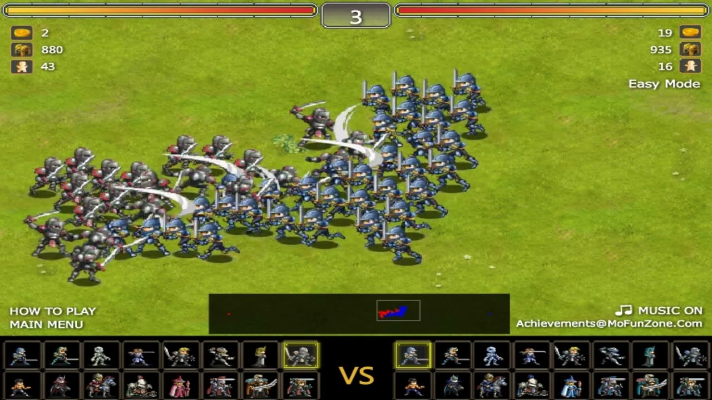

# Miragine Quest - opis elementów gry

## Inspiracja

Gra jest inspirowana grą flashową *Miragine War* ([przykładowy link](https://www.friv.com/z/games/miraginewar/game.html), pod którym można w nią zagrać).
Przykładowy screenshot z tej gry ([źródło](https://i.ytimg.com/vi/hS-iM9C909E/maxresdefault.jpg)):

## Fabuła

Królestwo Bajtolandii prężnie się rozwija podczas rządów królowej Bajtycji.
Niestety, siły ciemności kierowane przez arcyzłego maga O'Valisha porwały władczynię!
Twoim celem jest rozprawienie się z oddziałami czarnoksiężnika i uwolnienie królowej, żeby w krainie mógł znowu nastać spokój.
Aby to osiągnąć, musisz wspiąć się na wyżyny swoich umiejętności taktycznych i zniszczyć oddziały przeciwnika, jego struktury obronne, a finalnie pokonać samego maga O'Valisha.

## Przebieg rozgrywki

### Ogólne zasady

Na początku każdej rundy gracz wybiera typ jednostki, który chce wysłać do walki.
W zależności od posiadanych funduszy i limitu liczby jednostek, odpowiednie oddziały są tworzone i pojawiają się na polu bitwy, ruszając w stronę przeciwnika.
Każda runda trwa 40 sekund, ale jednostki można tworzyć tylko przez pierwsze 5 sekund (jeżeli starczy funduszy i limitu jednostek, można wysłać różne typy jednostek).
Przeciwnik wysyła oddziały do walki w analogiczny sposób.

### Typy jednostek

Gracz i przeciwnik dysponują różnymi typami jednostek, przy czym niektóre typy jednostek są wspólne dla gracza i dla przeciwnika, a inne są specyficzne dla danej strony.
Poszczególne typy jednostek charakteryzują się różnymi wartościami atrybutów, takich jak:
- koszt jednostki
- waga, czyli ile miejsc limitu dana jednostka zajmuje (lżejsze jednostki mają wagę 1, mocniejsze mają wagę odpowiednio większą)
- szybkość poruszania się
- szybkość ataku
- liczba punktów zdrowia
- liczba obrażeń zadawanych pojedynczym atakiem
- rodzaj ataku (fizyczny / magiczny)
- odporność na atak fizyczny
- odporność na atak magiczny

Gracz może uzyskać skrócone informacje dotyczące tych wartości po najechaniu na daną jednostkę w panelu wyboru.

### Obszar gry

Głównym obszarem gry jest prostokątna plansza, w której jeden wymiar (długość) definiuje części obszaru gry, a drugi odpowiada za głębię obszaru, żeby widok z kamery (która jest umieszczona pod pewnym kątem) był bardziej atrakcyjny.
Lewa połowa obszaru to część gracza.
Na jej skraju znajduje się królewicz Bajtomir (syn królowej, pierwszy w kolejce do tronu), który jest ostatnią ostoją po stronie sił gracza.
Tutaj również są tworzone jednostki na początku każdej rundy.
Prawa połowa obszaru to część przeciwnika.
W jej połowie znajdują się dodatkowe oddziały wartownicze pod dowództwem arcyzłego hetmana von Mueschke (niezależne od wysyłanych jednostek).
Na skraju czeka arcyzły mag O'Valish, który jest ostatnią przeszkodą na drodze do uwolnienia królewny.

#### Interfejs użytkownika

Poza "standardowymi" przyciskami służącymi do zapauzowania gry oraz powrotu do głównego menu gry, interfejs użytkownika obejmuje elementy skupione w dolnej części ekranu.
Znajdują się tam zminiaturyzowany podgląd mapy z symbolicznym zaznaczeniem jednostek gracza (niebieskie kropki) i jednostek przeciwnika (czerwone kropki) oraz podglądanego obszaru w głównym widoku gry (prostokąt), a także panel wyboru jednostek, w którym użytkownik zaznacza jednostkę/i, którą/e chce wysłać do walki w następnej rundzie; porównaj screen z oryginalnej gry u góry dokumentu.

### Koniec gry

#### Wygrana

Gracz wygrywa, jeżeli pokona oddział wartowniczy przeciwnika kierowany przez hetmana von Mueschke oraz arcyzłego maga O'Valisha.

#### Przegrana

Gracz przegrywa, jeżeli oddziały przeciwnika przeważą oddziały gracza i zabiją królewicza Bajtomira.

### Sterowanie

Gra może być w całości rozegrana z użyciem jedynie myszy.
Za pomocą myszki gracz może zaznaczać jednostki w panelu wyboru, przesunąć podgląd obecnie wyświetlanego obszaru gry na minimapie oraz zapauzować grę / wyjść do menu głównego.
Opcjonalnie, za pomocą strzałek lub klawiszy WASD gracz może zmieniać zaznaczoną jednostkę w panelu wyboru na sąsiednią w odpowiednim kierunku, w zależności od akcji użytkownika.

### Inne

#### Czas gry

W teorii gra może trwać w nieskończoność, ale przy odpowiedniej taktyce gra powinna trwać kilka-kilkanaście minut.

#### Trudność gry

Celem autora jest, żeby gra była stosunkowo nietrudna, ale to oczywiście subiektywna ocena i kwestia odpowiedniego zbalansowania atrybutów jednostek.
Gracz może wybrać jeden z trzech poziomów trudności: **Łatwy**, **Normalny** i **Trudny**.
Różnią się one między sobą przeskalowaniem odpowiednich atrybutów jednostek po stronie przeciwnika.

#### Etapy realizacji projektu

Kolejne etapy realizacji projektu są przedstawione w [pliku z opisem etapów](./roadmap.md).
