# Miragine Quest - dokumentacja

## Inspiracja

Gra jest inspirowana grą flashową *Miragine War* ([przykładowy link](https://www.friv.com/z/games/miraginewar/game.html), pod którym można w nią zagrać).
Przykładowy screenshot z tej gry ([źródło](https://i.ytimg.com/vi/hS-iM9C909E/maxresdefault.jpg)):
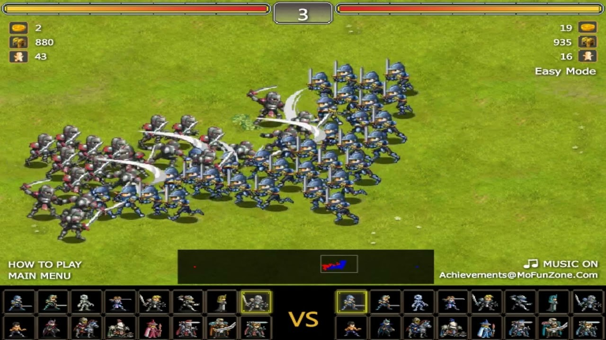

## Fabuła

Królestwo Bajtolandii prężnie się rozwija podczas rządów królowej Bajtycji.
Niestety, siły ciemności kierowane przez arcyzłego maga O'Valisha porwały władczynię!
Celem gracza jest rozprawienie się z oddziałami czarnoksiężnika i uwolnienie królowej, żeby w krainie mógł znowu nastać spokój.
Aby to osiągnąć, musi wspiąć się na wyżyny swoich umiejętności taktycznych i zniszczyć oddziały przeciwnika, jego struktury obronne, a finalnie pokonać samego maga O'Valisha.

## Wykorzystane narzędzia

Gra jest napisana w silniku Godot, wersja 4.6.
Skrypty programu są napisane w języku skryptowym `GDScript`.

### Użyte assety

Wykorzystane grafiki zostały przygotowane samodzielnie w programach graficznych (Paint / GIMP) lub jako dostępne za darmo assety.
Informacja o wykorzystanych zasobach jest dla każdego ich rodzaju zawarta w [folderze `credits`](./credits/).
Są tam pliki `.txt`, które zawierają informację zgodną z licencją, na której zostały udostępnione te assety.

Niektóre z grafik jednostek (spritesheety) zostały lekko zmodyfikowane, aby zniwelować przesunięcie klatek animacji.

### Użycie narzędzi sztucznej inteligencji (AI)

Na przestrzeni realizacji projektu narzędzia sztucznej inteligencji zostały wykorzystane w celu wspomagania pisania skryptów, a co za tym idzie, przekształcania autorskich pomysłów w działające elementy programu.

Narzędzia AI **nie były** użyte do generowania grafik, natomiast niektóre z użytych dźwięków (pobranych ze wskazanych źródeł) zostały w taki sposób wygenerowane.

## Przebieg projektu

Kolejne etapy realizacji projektu są przedstawione w [pliku z opisem etapów](./roadmap.md).

## Uruchomienie gry

Gra może być uruchomiona bezpośrednio w aplikacji silnika Godot lub na komputerze z systemem Windows jako plik wykonywalny `.exe`.
Gra została udostępniona na platformie `itch.io` - można ją znaleźć i pobrać pod [tym linkiem](https://wojciu331.itch.io/miragine-quest).

## Opis mechaniki gry

### Świat gry

Głównym obszarem gry jest prostokątna plansza, w której jeden wymiar (długość) definiuje części obszaru gry, a drugi odpowiada za głębię obszaru, żeby widok z kamery był bardziej atrakcyjny.
Niemniej jednak gra jest typu 2D.
Za pomocą klawiszy A i D można przesuwać podgląd obszaru gry przez kamerę odpowiednio w lewo / w prawo.
Klikając lewym przyciskiem myszy na minimapę można wybrać dowolną część obszaru gry do wyświetlenia.

Lewa połowa planszy to część gracza.
Na jej skraju znajduje się królewicz Bajtomir (syn królowej, pierwszy w kolejce do tronu), który jest ostatnią ostoją po stronie sił gracza.
Tutaj również są tworzone jednostki gracza na początku każdej rundy.
Z kolei prawa połowa obszaru to część przeciwnika.
W jej połowie znajdują się dodatkowe oddziały wartownicze pod dowództwem arcyzłego hetmana von Mueschke (niezależne od wysyłanych jednostek).
Na jej skraju czeka arcyzły mag O'Valish, który jest ostatnią przeszkodą na drodze do uwolnienia królewny.

### Typy jednostek

Gracz i przeciwnik dysponują różnymi typami jednostek, przy czym te jednostki odpowiadają sobie parami (mają bardzo podobne statystyki, jednostki przeciwnika mają nieco niższe obrażenia i mniej punktów zdrowia).
Poszczególne typy jednostek charakteryzują się różnymi wartościami atrybutów, takich jak:

- nazwa jednostki
- koszt jednostki (w złocie)
- waga jednostki, czyli ile miejsc limitu zajmuje
- rodzaj ataku - fizyczny lub magiczny, główne bazy (królewicz i arcyzły mag) mają atak specjalny
- szybkość poruszania się
- szybkość ataku
- liczba punktów zdrowia
- liczba obrażeń zadawanych pojedynczym atakiem
- zasięg ataku
- odporność na atak fizyczny
- odporność na atak magiczny

Gracz może uzyskać informacje dotyczące tych wartości w przystępnej formie po najechaniu na daną jednostkę w panelu wyboru i kliknięciu prawym przyciskiem myszy.
Analogicznie jest dla baz, przy czym nie mają one niektórych z tych statystyk, jako że są umieszczone statycznie na mapie: koszt, waga oraz szybkość poruszania się.

### System walki

Na początku każdej rundy gracz wybiera typ jednostki, który chce wysłać do walki.
W zależności od posiadanych funduszy i limitu liczby jednostek, odpowiednie oddziały są tworzone i pojawiają się na polu bitwy, ruszając w stronę przeciwnika.
Gracz może zmieniać zaznaczenie, tym samym wysyłając różne jednostki.

Każda runda trwa 40 sekund, ale jednostki można tworzyć tylko przez pierwsze 5 sekund (oczywiście jeżeli starczy funduszy i limitu jednostek) - tzw. faza kupowania.
Przeciwnik wysyła oddziały do walki w analogiczny sposób.

Po wysłaniu jednostek gracz już nie ma wpływu na ich zachowanie - atakują one wroga zgodnie z zaprogramowanym zachowaniem co do podążania za jednostkami przeciwnika i wybierania celu do ataku.

### Wskazówki taktyczne

Autor gry dołożył wszelkich starań, aby jednostki były dobrze zbalansowane, dzięki czemu gra pozostaje zacięta i nie kończy się natychmiastowo.
Jednakże, można zauważyć pewne strategie, które zwiększają szanse na zwycięstwo:

1. Armia złożona z nindż / słabszych magów (lub ich połączenie)

Wymienione jednostki mają stosunkowo małą wagę (przez co potencjalnie dużą liczebność, szczególnie w późniejszej fazie gry).
Cechują się przy tym dużą liczbą zadawanych obrażeń, przez co potrafią znacząco przeważyć armię wroga.

2. Armia złożona z najsilniejszych jednostek

Początkowo ta taktyka nie daje przewagi, ale z czasem (kiedy już jest większy limit wag i fundusze co rundę) wysłanie nawet kilku silnych wojowników powinno wystarczyć na liczebniejszą armię wroga.

Warto przy tym podkreślić, że wspomniane taktyki dobrze działają m.in. dlatego, że system dobierania armii przez komputer na pewno nie jest idealny, a także wszystkie jednostki cechują się atakiem _pojedynczym_, bez zasięgu rażenia - wtedy na pewno liczebne armie słabszych jednostek byłyby znacznie mniej opłacalne.

### Interfejs użytkownika

W trakcie gry gracz widzi przed sobą kilka różnych scen, które są opisane poniżej.

#### Menu główne

W menu głównym znajdują się następujące przyciski:

- `Rozpocznij grę` - jego kliknięcie przenosi gracza do sceny gry
- `Instrukcje` - jego kliknięcie pokazuje ekran ze szczegółowymi informacjami dotyczącymi gry i jej mechanik
- `Źródła` - jego kliknięcie pokazuje ekran z informacją o źródłach zasobów wykorzystanych w grze
- Przyciski wyciszenia: SFX jednostek (spawn, atak, śmierć) oraz baz (atak, śmierć), a także oddzielnie muzyka

W tle odbywa się samoistnie demo walki, które żyje własnym życiem - gracz nie ma na nie wpływu.

#### Główna scena gry

Elementy UI:

- paski życia głównych baz gracza i przeciwnika
- etykiety z czasem rundy oraz stanem walut (złoto i limit wag) dla gracza (lewa strona) oraz przeciwnika (prawa strona)
- główny panel na dole ekranu, który zawiera:

- - po lewej stronie okienka z jednostkami gracza (można je zaznaczać i podglądać statystyki)
- - po prawej stronie okienka z jednostkami przeciwnika (nie można ich zaznaczać, ale można podglądać statystyki)
- - na środku minimapę ze zminiaturyzowanym podglądem obszaru gry (aktualnie oglądana część jest oznaczona białym prostokątem, symboliczne zaznaczenie jednostek gracza poprzez niebieskie kropki i przeciwnika poprzez czerwone), a także przyciski do wyciszania audio (podobnie jak w menu głównym) i przycisk powrotu do menu głównego

Centralną część sceny zajmuje obszar gry.

### Sterowanie

Gra może być rozegrana w całości z użyciem jedynie myszy.
Za pomocą myszki gracz może zaznaczać jednostki w panelu wyboru, przesunąć podgląd obecnie wyświetlanego obszaru gry na minimapie oraz wybrać pożądane opcje w menu głównym / scenie gry.
Z wykorzystaniem prawego przycisku myszy gracz może uzyskać informacje o jednostkach / bazach, klikając na nie w głównej scenie gry.
Opcjonalnie, za pomocą klawiszy A i D gracz może przesuwać kamerę, aby zmienić obecnie podglądany obszar gry.

### Koniec gry

#### Wygrana

Gracz wygrywa, jeżeli pokona oddział wartowniczy przeciwnika kierowany przez hetmana von Mueschke oraz arcyzłego maga O'Valisha.
Po wygranej pojawia się ekran z informacją o zwycięstwie.

#### Przegrana

Gracz przegrywa, jeżeli oddziały przeciwnika przeważą oddziały gracza i zabiją królewicza Bajtomira.
Wtedy pojawia się ekran z informacją o przegranej.

### Inne informacje warte wspomnienia

#### Czas gry

W teorii gra może trwać w nieskończoność, ale przy odpowiedniej taktyce gra powinna trwać kilkanaście minut (i zakończyć się wygraną).

#### Trudność gry

Celem autora jest, żeby gra była stosunkowo nietrudna, ale to oczywiście subiektywna ocena i kwestia odpowiedniego zbalansowania atrybutów jednostek.
Warto podkreślić, że przeciwnik ma dodatkowe jednostki (baza w połowie jego obszaru), ale za to (aby poniekąd zrównoważyć) regularne jednostki po stronie przeciwnika mają mniej punktów zdrowia i obrażeń (około 5-7% w porównaniu do jednostek gracza).
W efekcie z upływem czasu ten czynnik coraz bardziej uwidacznia przewagę gracza.

#### Kim jest przeciwnik i jak rozumuje?

Gra jest przeznaczona **dla jednego gracza**.
Przeciwnikiem jest komputer.
Wartym wspomnienia jest algorytm wyboru jednostek przez komputer.
Stara się on podjąć _optymalną_ decyzję na podstawie posiadanych informacji o swoich jednostkach, dobierając armię do wysłania na podstawie jednostek posiadanych aktualnie przez gracza (żeby je skontrować).
System ten nie jest idealny, ale pozwala na zauważenie kilku taktyk, w których lubuje komputer.

W przypadku usystematyzowanego wyboru, komputer wysyła jednostki z dwóch _najbardziej opłacalnych_ typów.
W każdej rundzie jest 20% szans na _losowy wybór_ - wtedy wysyłane są jednostki czterech różnych typów, oczywiście wybranych losowo.

#### Harmonogram złota i zmian limitu wag

Na początku gry obie strony otrzymują 1000 sztuk złota (bazowa kwota na rundę) oraz mają limit wag jednostek wynoszący 20.
Zależnie od osiągów w danej rundzie (zabite jednostki strony przeciwnej) kwota złota otrzymana na początku następnej rundy jest zwiększana oraz podnoszony jest limit wag.
Co 5 rund te zyski są _względnie_ zmniejszane, ale biorąc pod uwagę rozrastającą się armię i zasoby - nie musi to być nominalnie mniejszy przypływ.

Jest twardy limit na zysk w jednej rundzie - wynosi on 8000 sztuk złota dla każdej ze stron.
Z kolei maksymalny, nieprzekraczalny limit wag to 120 (dla obu stron).

## Screenshoty z gry

Poniżej przedstawione są screenshoty przedstawiające różne elementy gry.

1. Menu główne gry

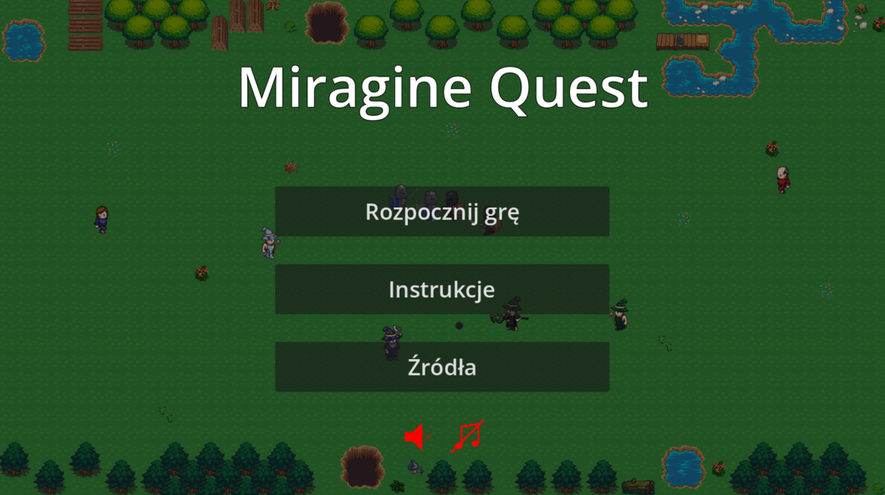

2. Przykładowa strona instrukcji

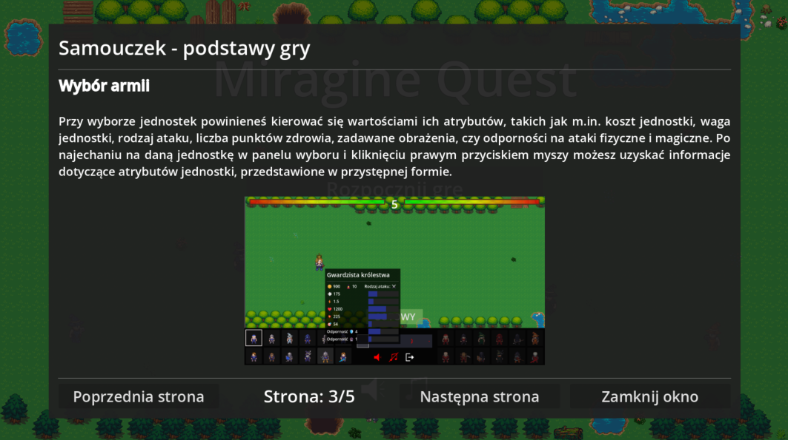

3. Strona ze źródłami

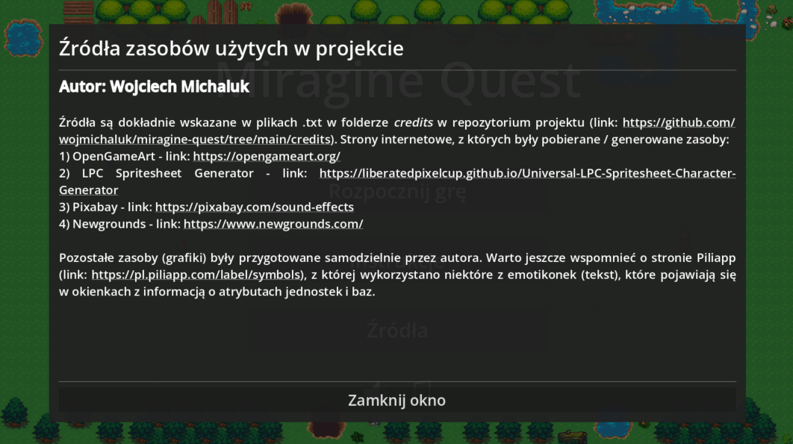

4. Ekran startowy po rozpoczęciu gry

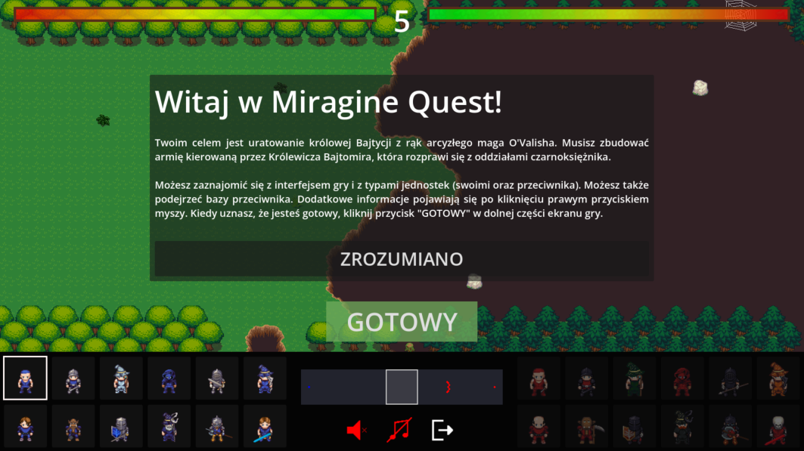

5. Przykładowy podgląd statystyk bazy

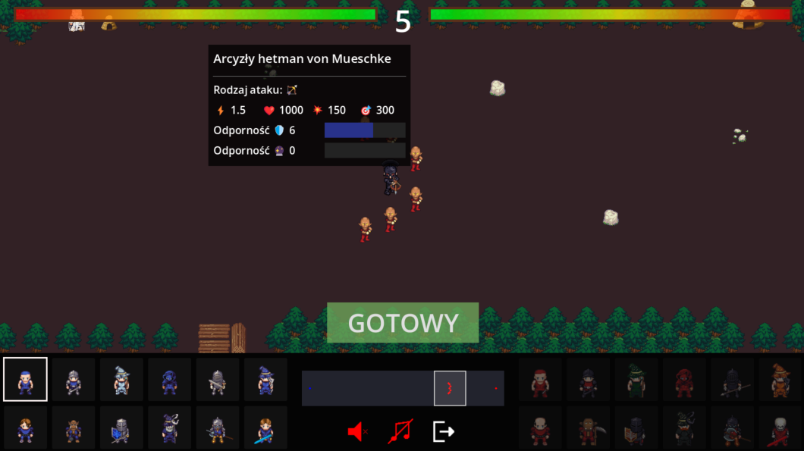

6. Przykładowy podgląd statystyk jednostki

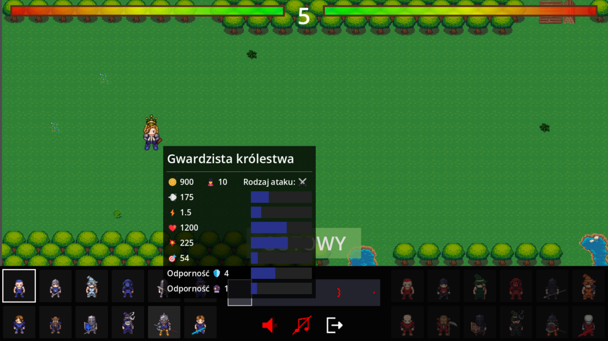

7. Przykładowe sceny walki

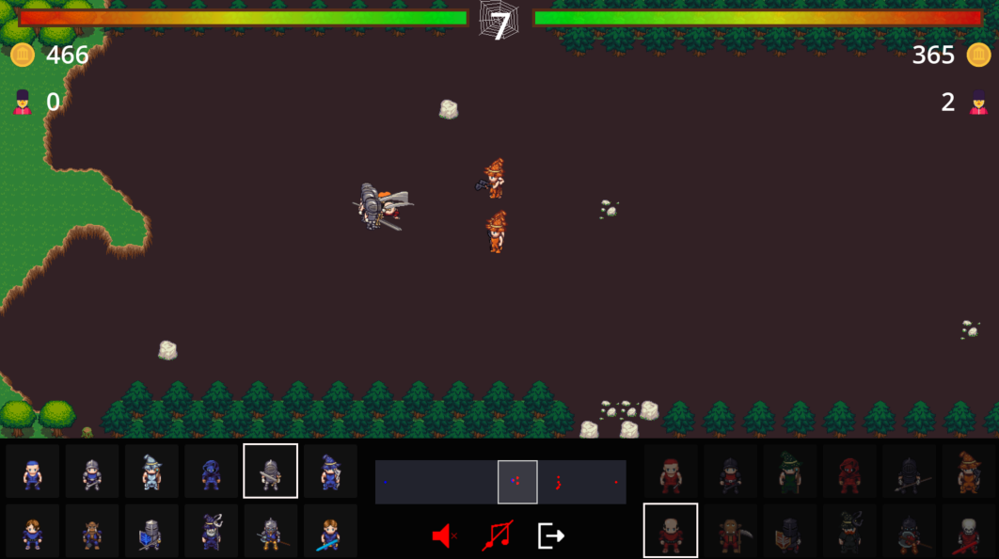
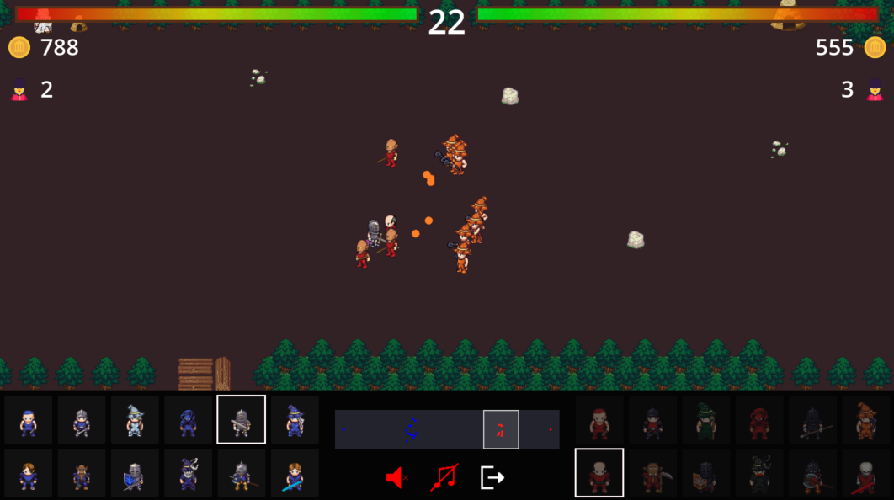

8. Atak bazy gracza

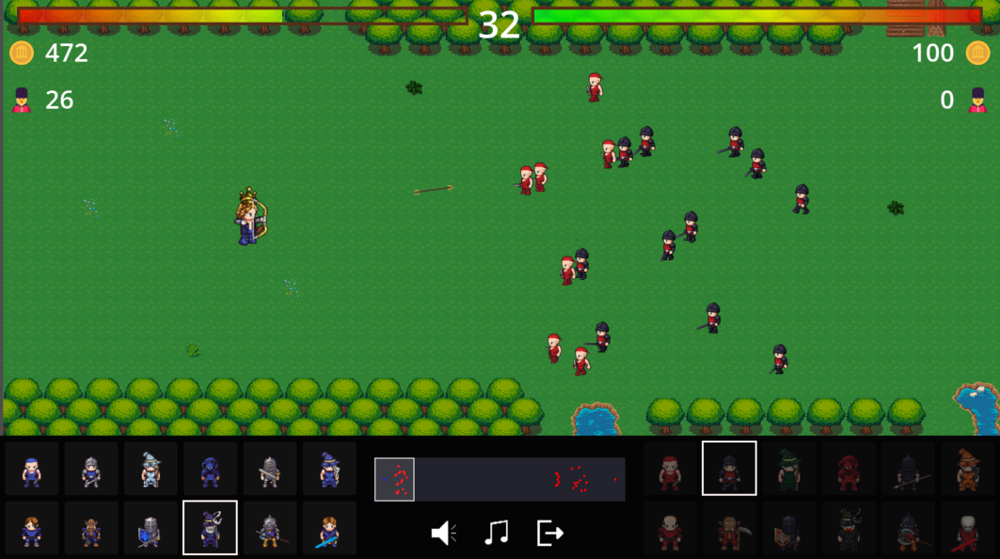

9. Atak bazy przeciwnika

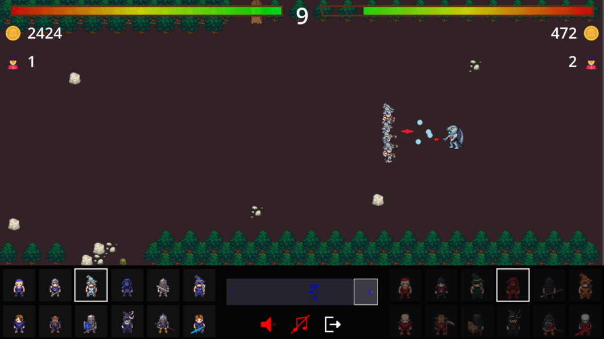

10. Ekran po wygranej

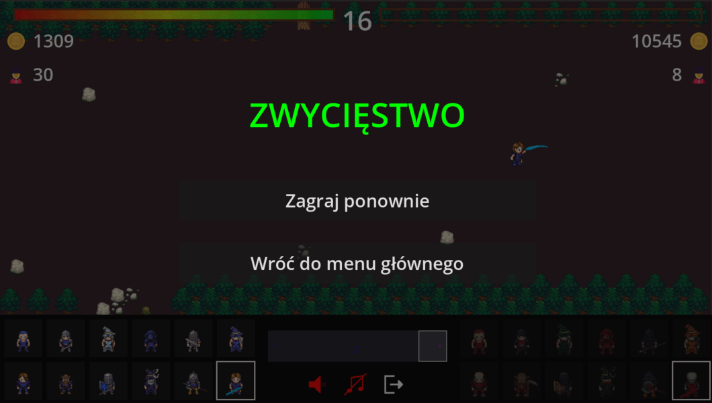

11. Ekran po przegranej

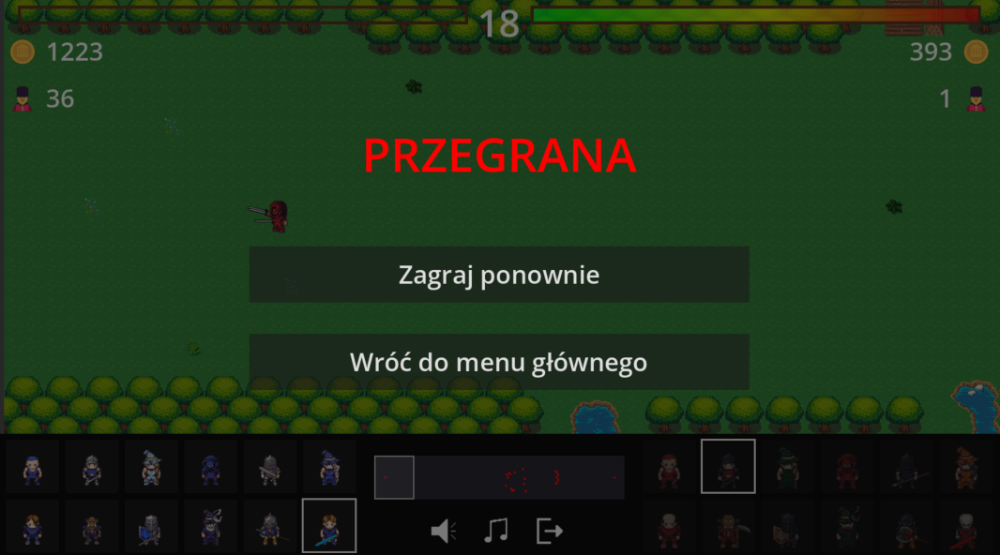
